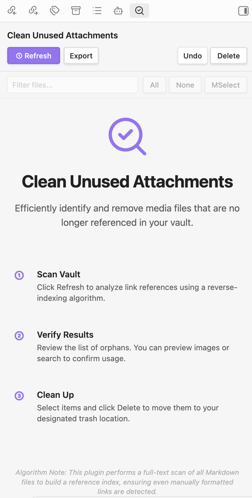
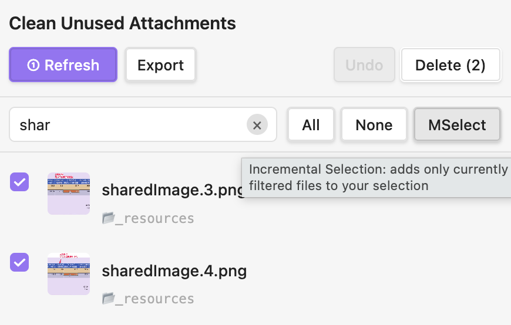
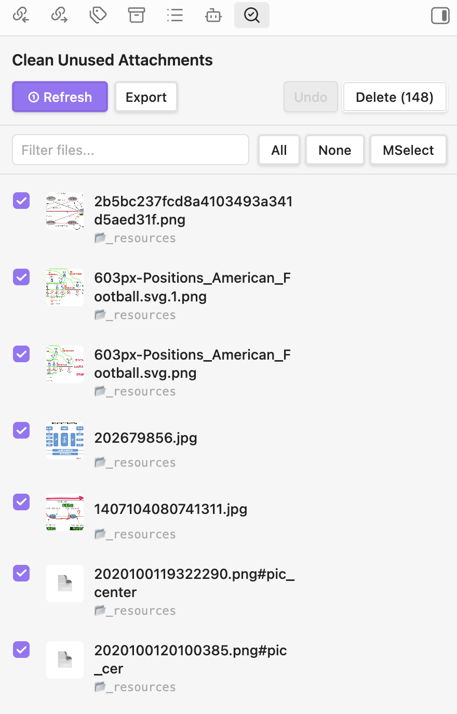
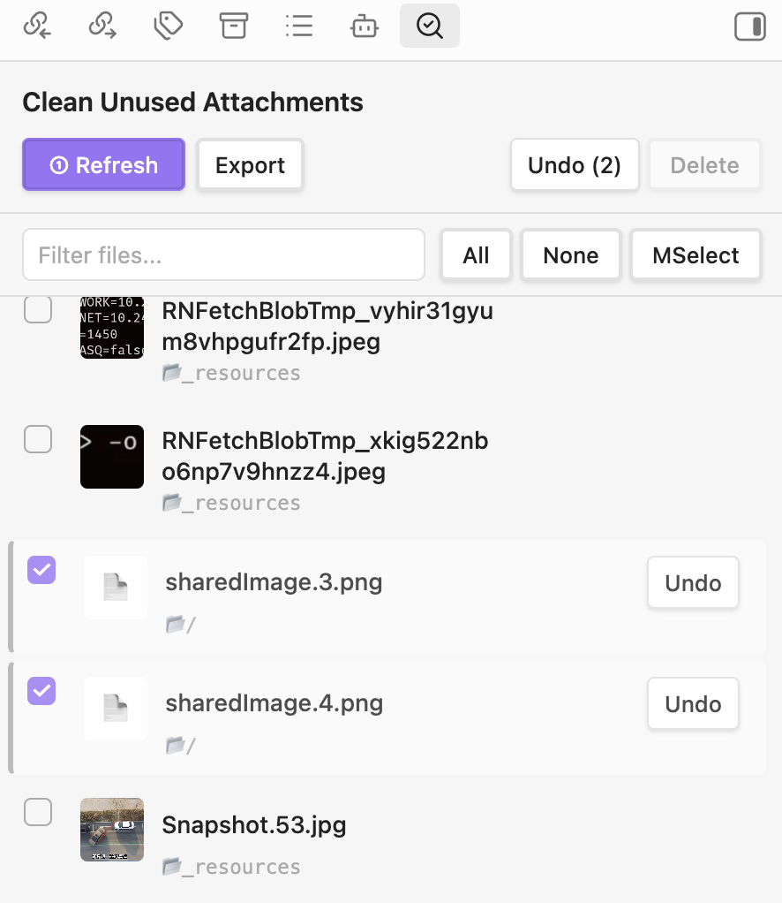

# Obsidian Clean Unused Attachments Plugin

Efficiently identify and remove media files that are no longer referenced in your Obsidian vault. This plugin scans your entire vault to find "orphan" attachments, providing a safe and intuitive way to keep your storage clean.

## Key Features

- **Deep Scan**: Uses a reverse-indexing algorithm to find unreferenced files across all your Markdown notes.
- **Visual Preview**: Hover over thumbnails to see magnified previews of images before deletion.
- **Reference Verification**: Quick search button for each file to verify its usage within the vault manually.
- **Incremental Selection (MSelect)**: Filter your files and add them to the selection batch without losing previous choices.
- **Safety First**: 
    - Supports Obsidian Trash, System Trash, or Permanent Deletion.
    - Built-in **Bulk Undo** and per-item restoration from trash.
- **Modern UI**: Clean, responsive sidebar interface with step-by-step guidance for a smooth workflow.

## How to Use

1. **Scan**: Click the **① Refresh** button to analyze your vault's reference structure.
2. **Review**: Browse the list of unused attachments. Use the search bar to filter by name.
3. **Select**: Manually pick files or use **All**, **None**, or **MSelect** (for filtered results) to batch select.
4. **Delete**: Click **Delete** to move selected files to trash.
5. **Undo**: Mistakenly deleted? Use the **Undo** button to restore files immediately.

## Methodology

|  |  |
| :---: | :---: |
| *Intuitive Dashboard* | *Advanced Batch Selection* |
|  |  |
| *Safe File Deletion* | *Instant Bulk Undo* |

This plugin builds a comprehensive index of all links in your vault (Wiki-links and Markdown links). It then compares this index against the actual files in your filesystem to identify those without a single valid reference. This ensures that even manually formatted links or links in complex note structures are accounted for.

## Credits

This plugin is deeply inspired by and based on [Ozan's Clear Unused Images](https://github.com/ozntel/oz-clear-unused-images-obsidian). It has been refactored and enhanced with modern UI elements, new selection logic, and stabilized background processing.

## License

MIT License. See [LICENSE](LICENSE) for details.

## Support

If you find this plugin helpful and would like to support its development, you can buy me a coffee:

